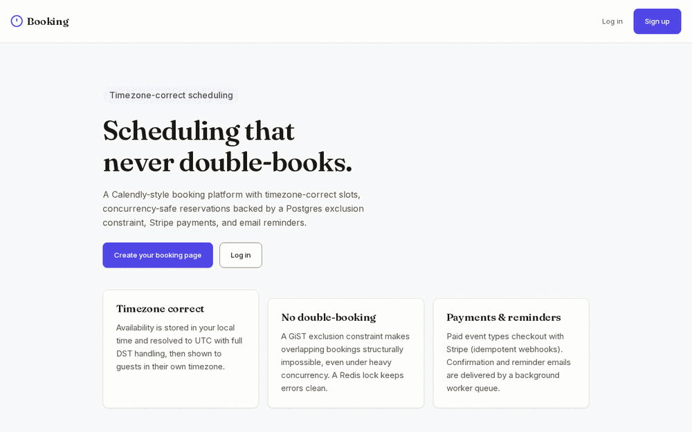
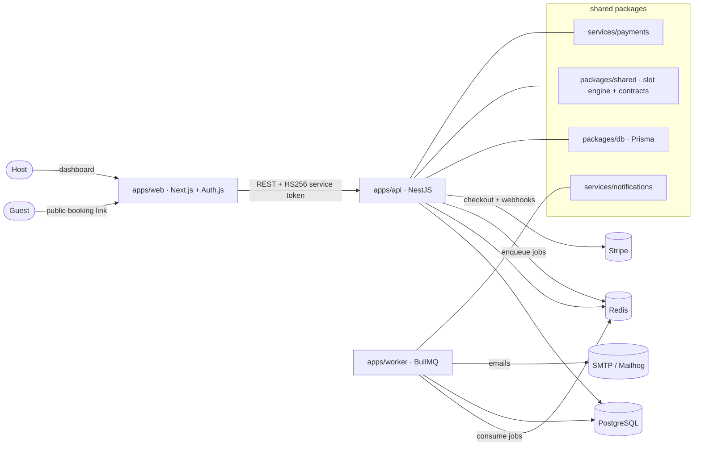

# Booking App — concurrency-safe, timezone-correct scheduling

A Calendly-style scheduling platform. Hosts publish event types and weekly availability; guests book
slots through a public link, pay (optionally) with Stripe, and get email confirmations and reminders.

The two hard problems are solved properly:

1. **No double-booking under concurrency** — a PostgreSQL `GiST` exclusion constraint makes overlapping
   bookings for a host structurally impossible, even when many clients race for the same slot. A Redis
   lock sits in front for clean error messages.
2. **Timezone / DST correctness** — availability is stored in the host's local wall clock and resolved to
   absolute UTC with full daylight-saving handling, then shown to each guest in their own timezone.




*The booking flow, recorded from the Playwright suite: a host publishes availability, a guest opens
the public link and books a slot, and the double-booking guard refuses the second attempt.*

Not deployed anywhere, deliberately: this repo is the artefact. It runs locally in about a minute
(see [Running it](#running-it)) and the flow above is reproducible with `pnpm --filter @booking/e2e
test:e2e`.

---

## Architecture



### How the guarantees work

- **Exclusion constraint** (`packages/db/prisma/migrations/*_booking_no_overlap`):
  `EXCLUDE USING gist (host_id WITH =, tstzrange(start_utc, end_utc, '[)') WITH &&) WHERE status <> 'CANCELLED'`.
  Two overlapping non-cancelled bookings for the same host can never both commit.
- **Redis lock** (`apps/api/src/redis/redis.service.ts`): `SET NX PX` per `host:slotStart`, released with a
  token-checked Lua script. Serializes racing attempts so losers get a clean `409`.
- **Slot engine** (`packages/shared/src/slots/engine.ts`): pure, deterministic, unit-tested against DST
  spring-forward and fall-back transitions.

---

## Tech stack

| Layer         | Choice                                                        |
| ------------- | ------------------------------------------------------------- |
| Frontend      | Next.js 14 (App Router), Auth.js v5 (credentials, JWT)        |
| Backend       | NestJS 10 (REST)                                              |
| Worker        | BullMQ (reminders, pending-booking expiry, heartbeat)         |
| Database      | PostgreSQL 16 + Prisma                                        |
| Cache / queue | Redis 7 (locks, BullMQ, worker heartbeat)                     |
| Payments      | Stripe (Checkout + idempotent webhooks), toggleable           |
| Email         | Nodemailer → Mailhog in dev                                   |
| Dates         | `date-fns` + `date-fns-tz`                                    |
| Tooling       | pnpm workspaces + Turborepo, TypeScript, Vitest, Playwright   |

## Monorepo layout

```
apps/web        Next.js: host dashboard + public booking + Auth.js
apps/api        NestJS: availability, slots, bookings, payments webhook, /health, auth
apps/worker     BullMQ workers: confirmation, reminder, expiry, heartbeat
services/payments        Stripe wrapper + contract
services/notifications   Email templates + transport
packages/db     Prisma schema + migrations (incl. exclusion constraint)
packages/shared slot engine + Zod contracts shared by web and api
infra           docker-compose + Dockerfiles
e2e             Playwright end-to-end tests
```

---

## Getting started

Prerequisites: Node 20+, pnpm (via `corepack enable`), Docker.

```bash
# 1. Infrastructure (Postgres + Redis + Mailhog)
docker compose -f infra/docker-compose.yml up -d

# 2. Install
pnpm install

# 3. Environment
cp .env.example .env        # generate AUTH_SECRET with: openssl rand -base64 32

# 4. Database
pnpm db:deploy              # apply migrations (creates the exclusion constraint)
pnpm db:seed                # demo host: demo@booking.local / password123

# 5. Run everything (web :3000, api :4000, worker)
pnpm dev
```

- Web: http://localhost:3000
- API health: http://localhost:4000/health
- Mailhog inbox: http://localhost:8027

Container ports are deliberately off the defaults (Postgres `5434`, Redis `6381`, Mailhog `1027`
and `8027`), so the stack starts on a machine that already runs a system PostgreSQL or another
project's Redis. The compose project is named `booking` for the same reason: without an explicit
name Compose derives it from the `infra/` directory, which every project in this portfolio has.

Payments are **off by default** (`PAYMENTS_ENABLED=false`), so paid event types auto-confirm without
Stripe keys. Set the flag to `true` and add test keys to enable the Stripe Checkout flow.

---

## Design — "calm precision"

A host chose this product and will learn it. A guest did not: they were sent a link by someone they
may barely know, and are being asked for a date, a name and an email, often on a phone, often in a
hurry. The whole visual language follows from that guest.

| | |
|---|---|
| **Canvas** | `#fafaf8` warm off-white / `#101319` dark |
| **Accent** | indigo `#4f46e5`, inverted to `#818cf8` in dark mode |
| **Type** | [Fraunces](https://fonts.google.com/specimen/Fraunces) for headings, [Inter](https://fonts.google.com/specimen/Inter) for everything read or typed. No monospace, deliberately |
| **Shape** | 10px radius, soft elevation instead of hairline borders |
| **Case** | sentence case throughout |

Four decisions worth naming:

**A month grid, not a dropdown.** `components/slot-picker.tsx` renders availability as a 7-column
month with a dot on every day that has times. A `<select>` of dates hides the shape of the week: a
guest cannot see that a host only works Tuesdays without opening it and reading thirty options.

**Every day key is a string.** `lib/month-grid.ts` does all calendar arithmetic on `YYYY-MM-DD`
strings and never constructs a local-time `Date`. `new Date('2026-03-01')` parses as UTC midnight,
which is the 28th of February in Santiago — a calendar built that way files slots under the wrong
day. `lib/month-grid.test.ts` builds the same month under four process timezones and asserts one
identical grid.

**The timezone is never implicit.** It is on screen before any time is, and `todayIn()` resolves
"today" in the *guest's* zone rather than UTC, so the highlighted cell is right at 23:00 in Sao Paulo.

**No monospace.** Mono reads as "developer tool". Times line up because Inter's tabular figures are
switched on, not because the face is fixed-width.

### The colours are tested, not eyeballed

`apps/web/lib/contrast.test.ts` parses the real `globals.css`, pulls both palettes out of it, and
fails the commit if any foreground/background pair drops below WCAG AA — 71 assertions across two
schemes. It reads the stylesheet rather than a copy, because a contrast test that passes against a
stale duplicate of the palette is worse than no test.

It is the reason dark mode uses a *lighter* indigo: `#4f46e5` on `#101319` measures 2.96:1, under the
3:1 WCAG 1.4.11 asks of a control boundary.

It also records something it cannot fix. In a dark scheme every state colour has to clear 4.5:1
against a near-black canvas, which forces green, amber and red into a narrow luminance band — so
"confirmed" and "cancelled" land within 1.12:1 of each other and render as one grey for the most
common colour-vision deficiency there is. No palette solves that. So colour is not the signal: every
badge carries a distinct glyph (`✓ ○ ✕`) and its own word, and the test asserts the glyphs are
distinct.

`apps/web/lib/identity.test.ts` pins the palette and the two typefaces, so this app cannot quietly
drift back into looking like a sibling repo.

---

## Testing

Four lanes:

```bash
pnpm test                                      # gate: unit tests (slot engine DST, payments, auth, worker, contrast, calendar)
pnpm --filter @booking/api test:integration    # concurrency: N racers, exactly 1 booking (needs DB+Redis)
./scripts/e2e.sh                               # Playwright: full host→guest flow + axe, boots the stack itself
./scripts/a11y-baseline.sh                     # records axe findings to a file instead of failing on them
```

The **integration test** is the proof of the core guarantee: it fires 12 concurrent booking requests at
the same slot and asserts exactly one succeeds, then asserts the DB rejects a direct overlapping insert.

The **accessibility spec** (`e2e/tests/a11y.spec.ts`) runs axe-core over every route that renders UI,
in both colour schemes, and asserts zero WCAG 2.1 A/AA violations. Taken before the redesign, the
same spec found 59 failing nodes: 28 unlabelled `<input type="time">` in the availability editor and
31 slot buttons below the contrast floor in dark mode. It is now zero and the spec keeps it there.

It signs in once via a Playwright `setup` project rather than per test, because `/auth/login` is
capped at 5 requests a minute per IP and that limit is a real control worth keeping — weakening it
for the test lane would mean testing a product that does not ship.

CI (`.github/workflows/ci.yml`) runs every lane on every push.

---

## Running the whole stack in containers

`pnpm dev` is the fast loop, but every service also has a Dockerfile and the compose file runs the
lot. This is not deployed anywhere; the images exist because a service that cannot start on its own
has a design problem, and CI builds all three on every push to prove they still can.

| Service    | Source                     | Notes                                                        |
| ---------- | -------------------------- | ------------------------------------------------------------ |
| web        | `infra/Dockerfile.web`     | Next.js standalone. `HOSTNAME=0.0.0.0` so it binds all interfaces, not just the loopback. |
| api        | `infra/Dockerfile.api`     | `PORT=4000` to match the port the app listens on. `prisma migrate deploy` runs before it serves. |
| worker     | `infra/Dockerfile.worker`  | BullMQ consumer; exposes no port. Its liveness is the Redis heartbeat `/health` reads. |
| Postgres   | `postgres:16-alpine`       | Named volume. `DATABASE_URL` for api + worker.                |
| Redis      | `redis:7-alpine`           | Named volume. `REDIS_URL` for api + worker.                   |

- api, worker and web share one `AUTH_SECRET` (the HS256 service-token contract). A mismatch is a
  total auth outage that presents as every request returning 401, so it is worth checking first.
- `NEXT_PUBLIC_API_BASE_URL` is inlined into the browser bundle **at build time**, so changing it
  after a build does nothing until the next one. api's CORS origin is `APP_BASE_URL`.
- **`/health` is real.** It returns `503` when Postgres or Redis is down and fails fast rather than
  hanging on a disconnected dependency, so it reports genuine dependency health rather than process
  liveness. `e2e/tests/health.spec.ts` asserts both the 200 and the contents.

### Environment variables

See `.env.example` for the full, documented list (database, Redis, Auth.js secret, Stripe keys +
`PAYMENTS_ENABLED`, SMTP, reminder lead time, pending-booking expiry).
