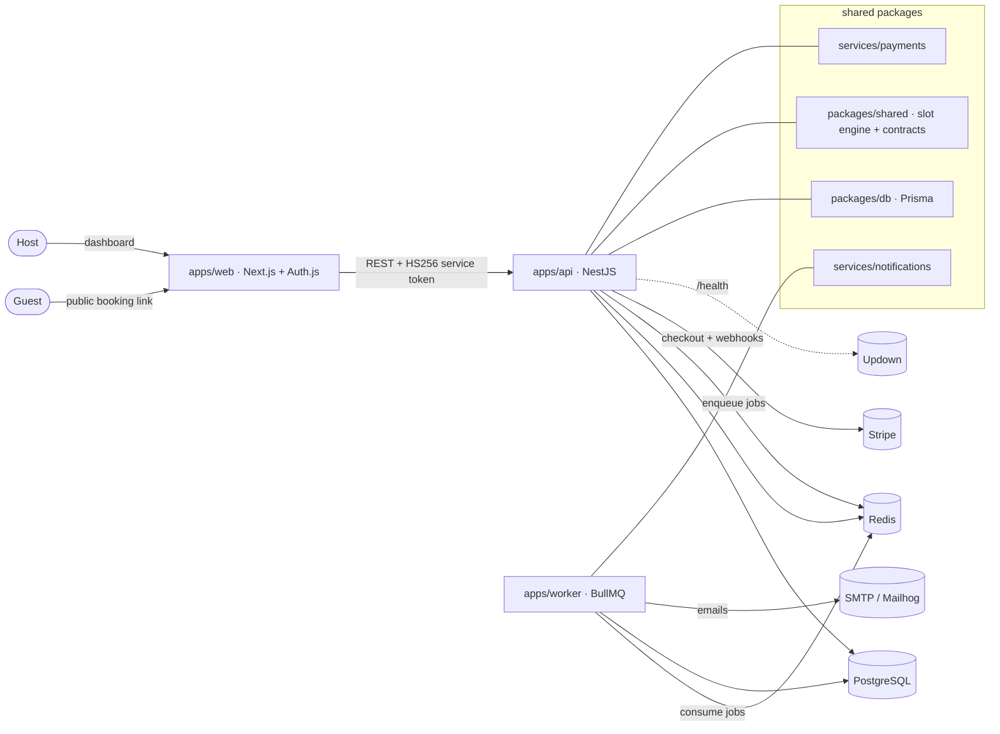

# Booking App — concurrency-safe, timezone-correct scheduling

A Calendly-style scheduling platform. Hosts publish event types and weekly availability; guests book
slots through a public link, pay (optionally) with Stripe, and get email confirmations and reminders.

The two hard problems are solved properly:

1. **No double-booking under concurrency** — a PostgreSQL `GiST` exclusion constraint makes overlapping
   bookings for a host structurally impossible, even when many clients race for the same slot. A Redis
   lock sits in front for clean error messages.
2. **Timezone / DST correctness** — availability is stored in the host's local wall clock and resolved to
   absolute UTC with full daylight-saving handling, then shown to each guest in their own timezone.


<!-- Updown: create a check on the /health URL below, then paste its badge token here. -->
[](https://updown.io)

**Live demo:** https://web-production-402d9.up.railway.app
· **Status page:** https://web-production-402d9.up.railway.app/status
· **Health:** https://api-production-96ce.up.railway.app/health

Try it: open the live demo, sign up as a host, set your weekly availability and an event type, then
open your public `/book/<slug>` link in another browser to book a slot as a guest. Payments are off in
this demo, so free event types confirm instantly.

---

## Architecture



### How the guarantees work

- **Exclusion constraint** (`packages/db/prisma/migrations/*_booking_no_overlap`):
  `EXCLUDE USING gist (host_id WITH =, tstzrange(start_utc, end_utc, '[)') WITH &&) WHERE status <> 'CANCELLED'`.
  Two overlapping non-cancelled bookings for the same host can never both commit.
- **Redis lock** (`apps/api/src/redis/redis.service.ts`): `SET NX PX` per `host:slotStart`, released with a
  token-checked Lua script. Serializes racing attempts so losers get a clean `409`.
- **Slot engine** (`packages/shared/src/slots/engine.ts`): pure, deterministic, unit-tested against DST
  spring-forward and fall-back transitions.

---

## Tech stack

| Layer         | Choice                                                        |
| ------------- | ------------------------------------------------------------- |
| Frontend      | Next.js 14 (App Router), Auth.js v5 (credentials, JWT)        |
| Backend       | NestJS 10 (REST)                                              |
| Worker        | BullMQ (reminders, pending-booking expiry, heartbeat)         |
| Database      | PostgreSQL 16 + Prisma                                        |
| Cache / queue | Redis 7 (locks, BullMQ, worker heartbeat)                     |
| Payments      | Stripe (Checkout + idempotent webhooks), toggleable           |
| Email         | Nodemailer → Mailhog in dev                                   |
| Dates         | `date-fns` + `date-fns-tz`                                    |
| Tooling       | pnpm workspaces + Turborepo, TypeScript, Vitest, Playwright   |

## Monorepo layout

```
apps/web        Next.js: host dashboard + public booking + Auth.js + /status
apps/api        NestJS: availability, slots, bookings, payments webhook, /health, auth
apps/worker     BullMQ workers: confirmation, reminder, expiry, heartbeat
services/payments        Stripe wrapper + contract
services/notifications   Email templates + transport
packages/db     Prisma schema + migrations (incl. exclusion constraint)
packages/shared slot engine + Zod contracts shared by web and api
infra           docker-compose + Dockerfiles
e2e             Playwright end-to-end tests
```

---

## Getting started

Prerequisites: Node 20+, pnpm (via `corepack enable`), Docker.

```bash
# 1. Infrastructure (Postgres + Redis + Mailhog)
docker compose -f infra/docker-compose.yml up -d

# 2. Install
pnpm install

# 3. Environment
cp .env.example .env        # generate AUTH_SECRET with: openssl rand -base64 32

# 4. Database
pnpm db:deploy              # apply migrations (creates the exclusion constraint)
pnpm db:seed                # demo host: demo@booking.local / password123

# 5. Run everything (web :3000, api :4000, worker)
pnpm dev
```

- Web: http://localhost:3000
- API health: http://localhost:4000/health
- Mailhog inbox: http://localhost:8025

Payments are **off by default** (`PAYMENTS_ENABLED=false`), so paid event types auto-confirm without
Stripe keys. Set the flag to `true` and add test keys to enable the Stripe Checkout flow.

---

## Testing

Three lanes:

```bash
pnpm test                              # gate: fast unit tests (slot engine DST, payments, auth, worker)
pnpm --filter @booking/api test:integration   # concurrency: N racers, exactly 1 booking (needs DB+Redis)
pnpm --filter @booking/e2e test:e2e            # Playwright: full host→guest flow (needs full stack)
```

The **integration test** is the proof of the core guarantee: it fires 12 concurrent booking requests at
the same slot and asserts exactly one succeeds, then asserts the DB rejects a direct overlapping insert.

CI (`.github/workflows/ci.yml`) runs all three lanes on every push.

---

## Deployment & monitoring

The live instance runs entirely on **Railway** (one project, five services):

| Service    | Source                     | Notes                                                        |
| ---------- | -------------------------- | ------------------------------------------------------------ |
| web        | `infra/Dockerfile.web`     | Next.js standalone. `HOSTNAME=0.0.0.0` so it binds all interfaces. |
| api        | `infra/Dockerfile.api`     | `PORT=4000` to match the port the app listens on. `prisma migrate deploy` runs as a pre-deploy step. |
| worker     | `infra/Dockerfile.worker`  | BullMQ consumer; no public domain.                           |
| Postgres   | Railway managed template   | Persistent volume. `DATABASE_URL` referenced by api + worker. |
| Redis      | Railway managed template   | Persistent volume. `REDIS_URL` referenced by api + worker.   |

- api ↔ worker ↔ web share one `AUTH_SECRET` (the HS256 service-token contract). api and worker reach the
  databases over Railway's private network; the browser calls api at its public domain (`NEXT_PUBLIC_API_BASE_URL`),
  so api's CORS origin is set to the web domain (`APP_BASE_URL`).
- **Monitoring:** point [Updown.io](https://updown.io) at the `/health` URL above. It returns `503` if Postgres
  or Redis is down (and fails fast — a disconnected dependency does not hang the check), so uptime reflects real
  dependency health, not just process liveness. Paste the resulting Updown badge token into the badge at the top.
- `/status` (web) renders a live service board from the same health endpoint.
- The web app also deploys cleanly to Vercel (root `apps/web`); Railway was chosen here to keep all five
  services in one project.

### Environment variables

See `.env.example` for the full, documented list (database, Redis, Auth.js secret, Stripe keys +
`PAYMENTS_ENABLED`, SMTP, reminder lead time, pending-booking expiry).
